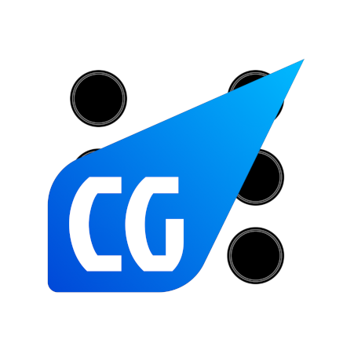

# 🎲 CG-Mobile-Lite (Backgammon)


pre-alpha, в разработке

**CG-Mobile-Lite** — это легковесная, адаптированная для мобильных устройств веб-реализация классической игры в Нарды (Backgammon). Проект построен на нативном JavaScript и использует WebSocket для обмена данными в реальном времени.

Приложение поддерживает полный цикл игры: от входа в лобби до анимации выбрасывания шашек с доски.

## ✨ Возможности

* **🎮 Игровые режимы:**
    * **PVE:** Игра против бота (настройка уровня сложности).
    * **PVP:** Мультиплеер в реальном времени (синхронизация через Socket.IO)(в разработке).
* **📱 Адаптивный интерфейс:**
    * Полная поддержка мобильных устройств (touch events)(в разработке).
    * Темная тема (Dark Mode) для комфортной игры.
    * Резиновая верстка доски (сохранение пропорций).
* **⚙️ Игровая механика:**
    * Валидация ходов (подсветка доступных точек).
    * Логика "Стеков": умное отображение большого количества шашек на одной позиции (сжатие).
    * Поддержка механики "Выброс шашек" (Bearing off).
    * Отмена хода (Undo).
    * Анимация броска костей и перемещения шашек.
* **🔊 Аудио:** Звуковое сопровождение ходов, ударов, бросков и уведомлений.
* **👤 Система аккаунтов:** Регистрация, авторизация, рейтинг игроков.

## 🛠 Технологический стек

* **Frontend:** HTML5, CSS3 (Flexbox, Grid, CSS Variables), Vanilla JS (ES6+).
* **Communication:** [Socket.IO Client](https://socket.io/) (v4.7.5), Fetch API.
* **Assets:** PNG графика, WAV звуковые эффекты.

## 📂 Структура проекта

```text
cg-mobile-lite/
├── index.html        # Точка входа, разметка сцен (Логин, Лобби, Игра)
├── style.css         # Стили, анимации, адаптивность
├── app.js            # Основная логика клиента (Socket.IO, Game State, UI)
└── assets/           # Ресурсы
    ├── Table0.png           # Фон доски
    ├── cgmLogo.png          # Логотип
    ├── whiteChecker0.png    # Текстура белой шашки
    ├── blackChecker0.png    # Текстура черной шашки
    ├── play.png             # UI элементы
    └── sounds/              # Звуковые эффекты (move, roll, hit, etc.)
